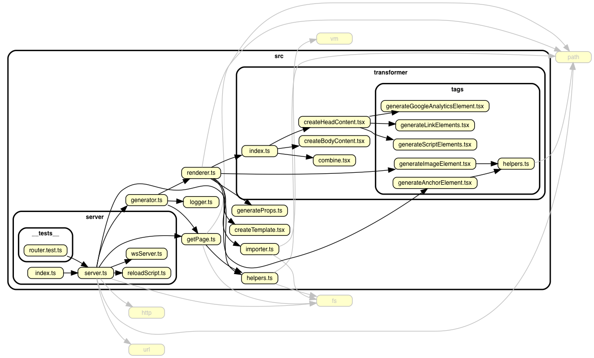

# CustomSite

Node製の静的サイトジェネレーター(Static Site Generator)です。

[](https://npm.im/custom-site)
[](https://travis-ci.com/custom-site/custom-site)
[](https://codecov.io/gh/custom-site/custom-site)
[](https://david-dm.org/custom-site/custom-site)
[](https://david-dm.org/custom-site/custom-site?type=dev)

## 使い方

### インストール

```sh
npm i -g custom-site
```

### すぐに使う

`mysite`というディレクトリを作成し、その中に`index.mdx`を作成します。

```sh
mkdir mysite
touch mysite/index.mdx
```

デバッグサーバーを立ち上げます。実行すると自動的にブラウザが立ち上がるでしょう。

```sh
custom-site ./mysite -Do
```

`index.mdx`を次のように編集します。
編集が終わったら保存します。このあとにブラウザのリロードの必要はありません！
ファイルの変更を検知したら自動的にリロードされます。

```md
---
title: Hello World
---

# MySite
```

### ビルド

静的なサイトとして出力してみましょう。
とても簡単です。次のコマンドを実行します。

```sh
custom-site mysite --out-dir site
```

これで`site`ディレクトリにHTMLファイルが出力されました。

## Library Development

```sh
yarn install
yarn start
```

## Architecture



## License

MIT &copy; [Himenon](https://github.com/Himenon)
